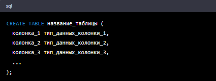
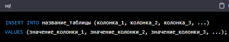
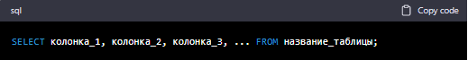
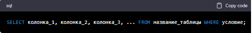
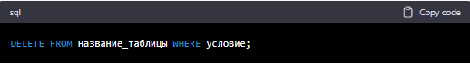

*MySQL - это система управления реляционными базами данных, которая позволяет хранить и обрабатывать данные. Ниже я перечислю и объясню некоторые основные команды mySQL.*

>1. CREATE DATABASE - создать новую базу данных

Пример:

>2. USE - выбрать базу данных для использования

Пример:

>3. CREATE TABLE - создать новую таблицу

Пример:

>4. INSERT INTO - добавить новую запись в таблицу

Пример:

>5. SELECT - извлечь данные из таблицы

Пример:

>6. WHERE - выбрать записи, удовлетворяющие определенному условию

Пример:

>7. UPDATE - обновить записи в таблице

Пример:

>8. DELETE - удалить записи из таблицы

Пример:

