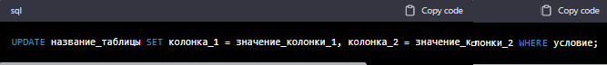

*MySQL - это система управления реляционными базами данных, которая позволяет хранить и обрабатывать данные. Ниже я перечислю и объясню некоторые основные команды mySQL.*

>1. CREATE DATABASE - создать новую базу данных

Пример:

>2. USE - выбрать базу данных для использования

Пример:

>3. CREATE TABLE - создать новую таблицу

Пример:

>4. INSERT INTO - добавить новую запись в таблицу

Пример:

>5. SELECT - извлечь данные из таблицы

Пример:

>6. WHERE - выбрать записи, удовлетворяющие определенному условию

Пример:

>7. UPDATE - обновить записи в таблице

Пример:

>8. DELETE - удалить записи из таблицы

Пример:

## Несколько примеров запросов на выбор:
>1. Простой запрос на выборку всех записей из таблицы:

SELECT * FROM название_таблицы;

>2. Запрос на выборку определенных столбцов из таблицы:

SELECT столбец_1, столбец_2, столбец_3 FROM название_таблицы;

>3. Запрос на выборку записей с условием:

SELECT * FROM название_таблицы WHERE столбец_1 = 'значение';

>4. Запрос на выборку записей с использованием нескольких условий:

SELECT * FROM название_таблицы WHERE столбец_1 = 'значение' AND столбец_2 
= 'значение';

>5. Запрос на выборку записей с использованием функций агрегирования:

SELECT COUNT(*) FROM название_таблицы;

>6. Запрос на выборку записей с сортировкой по возрастанию:

SELECT * FROM название_таблицы ORDER BY столбец_1 ASC;

>7. Запрос на выборку записей с сортировкой по убыванию:

SELECT * FROM название_таблицы ORDER BY столбец_1 DESC;

>8. Запрос на выборку записей с использованием группировки:

SELECT столбец_1, COUNT(*) FROM название_таблицы GROUP BY столбец_1;

>9. Запрос на выборку записей с использованием вложенных запросов:

SELECT * FROM название_таблицы WHERE столбец_1 IN (SELECT столбец_1 FROM другая_таблица WHERE условие);

**Звездочка (*) в запросе SELECT означает, что нужно выбрать все столбцы из таблицы, указанной после ключевого слова FROM. То есть, вместо перечисления всех столбцов таблицы в запросе, можно использовать звездочку для выбора всех столбцов.**

Например, запрос:

**Выбирает все столбцы из таблицы с названием "название_таблицы". Если в таблице есть столбцы "столбец_1", "столбец_2", "столбец_3", то этот запрос вернет все записи из таблицы, включая значения этих столбцов для каждой записи.**

**Важно отметить, что использование звездочки в запросе SELECT может быть неэффективным, если таблица имеет большое количество столбцов или если нужны только определенные столбцы. В таких случаях лучше указывать имена нужных столбцов в запросе SELECT вместо звездочки.**
